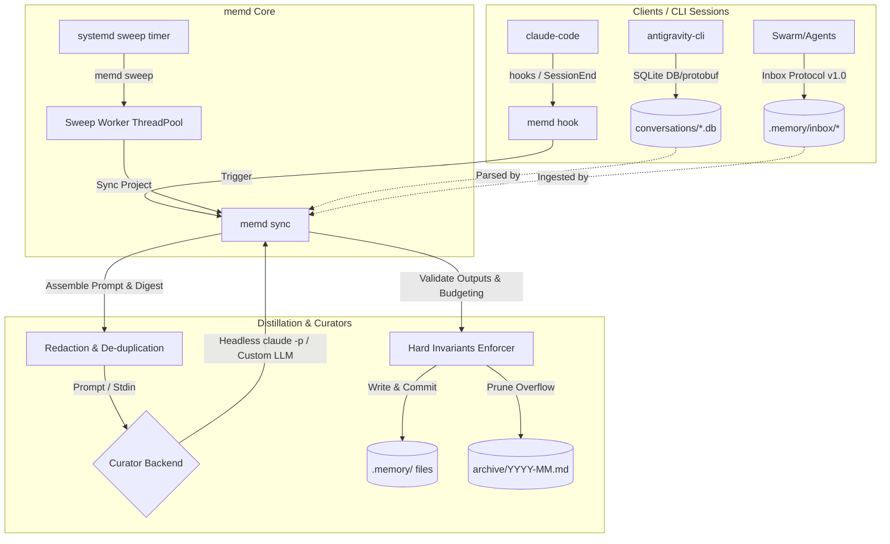

# memd — Agent-Driven Project Memory Curator

<p align="center">
  
</p>

[](https://github.com/lowcache/memd)
[](#installation)
[](LICENSE)
[](#nix-installation)

`memd` gives your AI coding tools a memory that survives between sessions. It runs quietly in the background, reads the session logs your CLIs leave behind (`claude-code`, `antigravity-cli`, custom agents), and boils them down into a few small, git-versioned markdown files under `./.memory/` — the stuff worth remembering, minus the noise.

---

## Why memd?

Every AI coding session ends the same way: the context window fills up, the session closes, and everything the model figured out — the port that service actually runs on, why you picked SQLite, the bug it hit last Tuesday — is gone. Next session it asks the same questions and steps on the same rakes.

`memd` fixes that by keeping a small set of memory files up to date automatically:
*   **Remembers what matters:** current system state, active decisions, and open todos, in plain markdown you can read yourself.
*   **Skips what doesn't:** conversational back-and-forth and tool spam get dropped; only durable facts survive.
*   **Works with a crowd:** a lock-safe inbox lets any agent, script, or human hand a note to the curator without stepping on anyone else.
*   **Keeps receipts:** memory changes are committed to git, so you can see how your project's context evolved over time.

---

## How It Works

Sessions end (or a timer fires), memd collects whatever is new — transcripts, databases, inbox notes — scrubs it for secrets, and hands it to a small "curator" model that rewrites the memory files. Python code, not the model, gets the final say on what's allowed to change.



---

## The Four Memory Files

Everything lands in four markdown files under `./.memory/`:

| File | What's in it | House rules |
| :--- | :--- | :--- |
| `state.md` | What's true *right now*: ports, directory layout, running services, active workarounds. | Present tense only. When a fact goes stale it gets replaced — no history kept here. |
| `decisions.md` | What was decided, why, and what that rules out. | Each entry has to actually constrain future work, not just describe the past. |
| `todo.md` | What's still open: tasks, roadmap items, things to verify. | Finished or abandoned items move to the archive. |
| `mistakes.md` | What went wrong before, and how to not do it again. | Append-only. Each entry: symptom, root cause, and the rule that prevents a repeat. |

*Anything that overflows the size budgets gets moved to `./.memory/archive/YYYY-MM.md` instead of deleted.*

---

## Teaching Your Agents to Use the Memory

Keeping the memory curated is only half the job. The models working in your codebase won't read `.memory/` unless something tells them it exists and how to behave around it. The rules boil down to three:

1.  **Read first.** Check `state.md`, `decisions.md`, `mistakes.md`, and `todo.md` (or run `memd brief` for a short digest) before doing real work.
2.  **Don't edit the memory files.** The curator owns them and rewrites them on every pass — hand-edits just get overwritten.
3.  **Send new facts through the inbox.** `memd note -m "..."`, or drop a file in `.memory/inbox/`. One fact per note.

You don't have to write those instructions yourself. [`contrib/agents/`](contrib/agents/) ships ready-made instruction files for the major tools — drop the right one into your project and you're done:

| Tool | File | Goes in |
| :--- | :--- | :--- |
| Codex, Cursor, Gemini CLI, Zed, and anything else on the [agents.md](https://agents.md) standard | `AGENTS.md` | project root |
| Claude Code (knows about memd's hooks) | `CLAUDE.md` | project root |
| Gemini / antigravity-cli | `GEMINI.md` | project root |
| GitHub Copilot | `copilot-instructions.md` | `.github/` |
| Cursor (rules format) | `memd.mdc` | `.cursor/rules/` |

Already have a `CLAUDE.md` or `AGENTS.md`? Append the memd section instead of overwriting — the files are written to compose. Details in [`contrib/agents/README.md`](contrib/agents/README.md).

---

## Guardrails Enforced by Code (Not the LLM)

The curator model is useful but not trusted. The rules that keep memory intact live in plain Python, so a confused (or prompt-injected) model can't wreck the store:

1.  **Frontmatter required:** Every memory file must carry valid YAML frontmatter (`type`, `project`, `last_updated`, `status`), or the write is rejected.
2.  **Mistakes are forever:** `mistakes.md` is append-only. The curator can add entries but never edit or delete old ones.
3.  **Shrink guard:** A distill that would delete more than 60% of a file gets rejected — unless the removed sections were explicitly moved to the archive.
4.  **Size budgets:** Each file has a character cap (set in `config.json`). Overflow gets moved to `./.memory/archive/YYYY-MM.md`, oldest sections first.
5.  **No races:** Per-project file locking (`flock`) keeps concurrent sweeps, hooks, and agents from corrupting each other's writes.
6.  **Nothing skipped:** memd tracks how far it has read into each transcript and database, and only advances that marker after a successful distill and write — a failed run just gets retried from the same spot.

---

## Where the Raw Material Comes From

`memd` pulls from several sources before each distill:

### 1. `claude-code` Hooks
`memd` plugs into the `claude-code` CLI through lifecycle hooks in `~/.claude/settings.json` (wired up for you by `memd install-hooks`):
*   **Session start:** the memory brief gets injected into the assistant's starting context, so it begins the session already knowing the project.
*   **Session end / pre-compact:** a background `memd sync` digests the transcript of the session that just finished.

### 2. `antigravity-cli` Database Parsing
For `antigravity-cli`, `memd` reads the SQLite conversation databases in `~/.gemini/antigravity-cli/conversations/*.db` directly:
*   Pulls out the useful steps — user inputs, assistant responses, tool actions, errors.
*   Figures out which project a conversation belongs to by counting workspace-path mentions in the payloads (index kept in `~/.local/state/memd/ag_index.json`).

### 3. The Inbox Protocol (v1.0)
The inbox is how everything else — another agent, an MCP tool, a CI script, you with a text editor — hands a fact to the curator without touching the memory files directly. Drop a markdown note in the inbox; the next sweep folds it into memory and deletes the note.

*   **Project Inbox:** `<project-root>/.memory/inbox/` (feeds local project files)
*   **Global Inbox:** `<global_root>/.memory/inbox/` (default `~/.memory/inbox/`, feeds system-wide/cross-project files)

#### Rules for Writers
The inbox has many writers and one reader that deletes what it consumes, so a sloppy writer can lose data for everyone. Every writer must publish atomically:
1.  **Stage Outside the Inbox:** Write the markdown note to a temporary file in the *parent* `.memory/` directory (e.g. `.remember-*.tmp`).
2.  **fsync the File:** Durably sync the data to disk (`flush` + `fsync`).
3.  **Atomic Publish:** Publish to the `inbox/` directory via `rename(2)` or `link(2)` (`os.replace` or `os.link`).
4.  **fsync the Inbox Directory:** Ensure the parent directory structure is updated.
5.  **Collision-Proof Names:** Name files using microsecond-resolution timestamp + PID (e.g., `20260711T123000123456-9876.md`).
6.  **Write-Once:** Never modify or reuse a published note.

For complete writer/reader guidelines, see [INBOX-PROTOCOL.md](INBOX-PROTOCOL.md).

### 4. Extra Custom Sources
Additional text transcript sources (e.g. custom JSONL logs) can be registered per-project under the `projects.<path>.extra_sources` array in `config.json`.

---

## Configuration (`config.json`)

Configuration is stored in `$XDG_CONFIG_HOME/memd/config.json` (defaults to `~/.config/memd/config.json`).

### Key Reference & Defaults

| Option | Type | Default | Description |
| :--- | :--- | :--- | :--- |
| `claude_bin` | `string` | `"claude"` | Name or path of the `claude-code` binary. |
| `curator_cmd` | `array` | `[]` | Override list of arguments to invoke a custom curator backend (e.g., `["nix", "run", ".#", "--", "status"]`). Substitutes `{model}`. If empty, falls back to the headless `claude_bin` command. |
| `antigravity_dir` | `string` | `"~/.gemini/antigravity-cli"` | Directory containing native SQLite database conversations. |
| `model_small` | `string` | `"haiku"` | Model used for small/routine transcript distills. |
| `model_large` | `string` | `"sonnet"` | Model used for large/complex session distills. |
| `escalate_chars` | `integer` | `15000` | Character count above which digests are run with `model_large`. |
| `digest_cap_chars` | `integer` | `60000` | Maximum length of transcript digest fed to the LLM. |
| `quiet_seconds` | `integer` | `600` | Skip digesting transcripts modified within this cooldown period. |
| `sweep_jobs` | `integer` | `4` | Number of worker threads for parallel sweeps. |
| `auto_scaffold` | `boolean` | `true` | Auto-create `.memory/` structure inside detected git repositories. |
| `git_commit` | `boolean` | `true` | Automatically run `git commit` on memory files after successful distill. |
| `budgets` | `object` | See below | Dictionary specifying character size caps for active memory files before archiving. |
| `REDACT_EXTRA_PATTERNS` | `array` | `[]` | List of raw regex patterns for custom credential redaction. |
| `exclude` | `array` | `[]` | List of absolute project paths to ignore during sweeps. |
| `projects` | `object` | `{}` | Mapping of absolute paths to project definitions: `{"<path>": {"name": "memd", "extra_sources": ["*.jsonl"]}}`. |
| `global_root` | `string` | `HOME` | Path to the global fallback project root. |
| `global_brief_chars` | `integer` | `800` | Max character excerpt of global `state.md` injected into a project's brief. |

#### Default File Budgets
```json
"budgets": {
  "state.md": 10000,
  "decisions.md": 12000,
  "todo.md": 10000,
  "mistakes.md": 22000
}
```

---

## Built-In Credential Redaction

Session transcripts have a bad habit of containing API keys. Before anything reaches the curator model, `memd` scrubs it with a set of regex filters, so a token that leaked into a transcript doesn't leak again into a prompt (or into a git-committed memory file).

13 rules are built in:
*   `google_oauth` (Google OAuth2 tokens, `ya29.` prefix)
*   `github_pat` (Classic and fine-grained GitHub tokens)
*   `anthropic_key` (Anthropic API keys, `sk-ant-` prefix)
*   `openai_key` (OpenAI API keys, `sk-` / `sk-proj-` prefix)
*   `aws_access` (AWS Access Key IDs, `AKIA` prefix)
*   `slack_token` (Slack bot/user/workspace tokens, `xox` prefix)
*   `gitlab_token` (GitLab PATs, `glpat-` prefix)
*   `npm_token` (npm access tokens, `npm_` prefix)
*   `jwt` (JSON Web Tokens starting with `eyJ`)
*   `json_token_field` (JSON keys containing `access_token`, `refresh_token`, etc.)
*   `bearer_header` (HTTP Authorization headers with Bearer tokens)
*   `env_credential` (UPPERCASE credentials assigned in `.env` or shell exports)
*   `ssh_private_key` (PEM blocks starting with `-----BEGIN ... PRIVATE KEY-----`)

> [!NOTE]
> Azure storage/service keys do not have a distinct prefix and cannot be reliably matched without high false-positive rates. Use `REDACT_EXTRA_PATTERNS` to configure rules matching your specific Azure keys if needed.

---

## CLI Command Quick Reference

| Command | Usage | Exit Codes & Notes |
| :--- | :--- | :--- |
| `memd init [path]` | Scaffold `.memory/` & register a project. Supports `--name <name>` and `--global` (sets up the fallback root). | `0` (Success), `2` (Config error) |
| `memd sync` | Distill new session content into memory. Supports `--project <path>`, `--transcript <path>`, `--trigger <name>`, and `--dry-run`. | `0` (Success/No-op), `3` (Curator/distill failure) |
| `memd sweep` | Periodic sweep to catch up all projects, ingest inbox files, and detect new git projects. Supports `--jobs <N>`. | `0` (Success), `1` (Any worker failed) |
| `memd brief [path]` | Print the session-start brief (context injection). Supports `--max-chars <N>` and `--topic <keyword>`. | Prints brief text to stdout. |
| `memd status` | Display registry, backlog bytes, and last distill summaries. | Prints status details. |
| `memd install-hooks` | Idempotently wire hooks into `~/.claude/settings.json`. | Configures hooks. |
| `memd note` | Append a collision-safe note to the project or global inbox. Supports `-m "<message>"` and `--global`. | `0` (Success), `2` (Config error) |
| `memd exclude <path>`| Exclude a path from automatic project discovery. | Registers path to exclude list. |
| `memd hook <event>` | Invoked by `claude-code` CLI lifecycle events. | `session-start`, `session-end`, `pre-compact` |

---

## Installation

### pip Installation

Requires Python **3.10+**. `memd` has zero runtime dependencies (standard library only).

```bash
# From PyPI
pip install memd

# With pipx (recommended for CLI tools — isolated, no system-Python friction)
pipx install memd

# Directly from the repository, no PyPI needed
pip install git+https://github.com/lowcache/memd

# From a local clone (add -e for editable/development mode)
pip install .
```

> **PEP 668 note:** distributions that mark the system Python as externally managed (NixOS, Debian 12+, Arch, Fedora 38+) reject bare `pip install` outside a virtual environment. Use `pipx`, or a venv: `python3 -m venv ~/.venvs/memd && ~/.venvs/memd/bin/pip install memd`.

### Nix Installation

`memd` is packaged as a Nix flake. You can run or install it directly:

```bash
# Run ad-hoc from the flake
nix run github:lowcache/memd -- status

# Install to user profile
nix profile install github:lowcache/memd
```

#### Declarative Setup via Home Manager
Import the module and enable the periodic sweep timer:

```nix
{ inputs, pkgs, ... }: {
  imports = [ inputs.memd.homeManagerModules.default ];

  services.memd = {
    enable = true;
    installClaudeHooks = true; # Idempotently configure ~/.claude/settings.json hooks

    sweep = {
      enable = true;            # Periodically execute `memd sweep`
      interval = "30min";       # Timer interval (default: "30min")
      onBoot = "5min";          # Delay after boot before running the first sweep (default: "5min")
      randomizedDelay = "2min"; # Randomized delay jitter (default: "2min")
    };
  };
}
```

#### Standalone systemd User Service & Timer

For non-Nix environments, a standalone systemd user service and timer can be set up using files in the `contrib/` directory:

```bash
# Copy units to the user systemd directory
cp contrib/memd-sweep.* ~/.config/systemd/user/

# Reload the systemd user manager
systemctl --user daemon-reload

# Enable and start the timer
systemctl --user enable --now memd-sweep.timer
```

Refer to [contrib/README.md](contrib/README.md) for detailed customization and uninstallation instructions.

### Manual Installation (no pip, no Nix)

`memd` is compatible with **Python 3.10 to 3.13** and uses standard library packages exclusively, so a plain clone runs as-is:

```bash
git clone https://github.com/lowcache/memd && cd memd
./memd.py --help
```

Symlink the shim onto your `PATH` for a live-updating install: `ln -s "$PWD/memd.py" ~/.local/bin/memd`.

---

## Testing & Verification

161 automated tests cover the parts that would hurt if they broke: XDG isolation, cursors, redaction, database parsing, atomic inbox publishing (including an 8-writer concurrency stress test), retry policies, brief budgeting, and curation quality. Verified on Python 3.10 through 3.13.

To run tests in a Nix-isolated environment:
```bash
nix flake check
```

Or run via `pytest` locally:
```bash
python -m pytest tests/ -q
```
