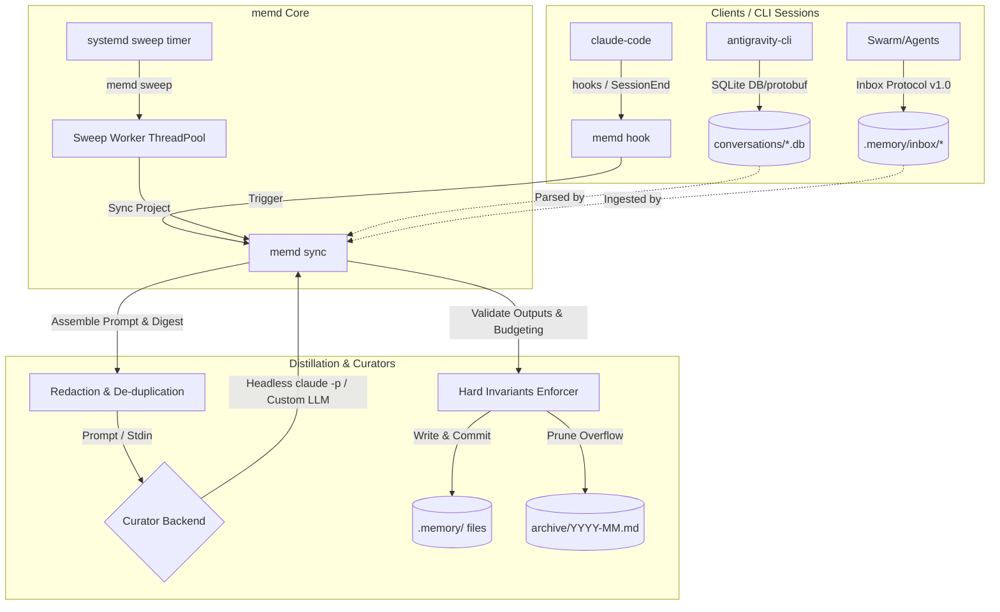

# memd — Agent-Driven Project Memory Curator

[](https://github.com/lowcache/memd)
[](#installation)
[](LICENSE)
[](#nix-installation)

An automated, headless project memory archivist designed to maintain durable context for AI coding assistants. `memd` monitors your workspaces, processes session logs from various CLIs (`claude-code`, `antigravity-cli`, and custom agents), and distills them into a structured, Git-versioned knowledge base under `./.memory/`.

---

## Why memd?

As AI coding assistants and multi-agent swarms operate on a codebase, they inevitably generate long transcripts, encounter configuration quirks, and make architectural decisions. Standard session limits cause models to lose context over time, leading to repetitive questions, forgotten constraints, and recycled mistakes.

`memd` solves this by continuously curating a lightweight, high-signal set of active markdown memory files:
*   **Context Preservation:** Keeps a structured log of the current system state, active decisions, and todo roadmaps.
*   **Noise Reduction:** Discards conversational chatter and tool execution details, retaining only what a future agent needs.
*   **Swarm Coordination:** Provides an asynchronous, lock-safe inbox interface for multi-agent collaboration.
*   **Git Integration:** Automatically commits memory changes to track the evolution of your project context.

---

## Architectural Flow



---

## Memory File Structures

`memd` scaffolds and curates four distinct markdown files under `./.memory/`:

| File | Purpose | Rules & Formatting |
| :--- | :--- | :--- |
| [`state.md`](#statemd) | **System State:** The single source of truth for the *current* live status. Contains ports, directory maps, active services, hardware specs, and active workarounds. | Written in the present tense. Stale facts are immediately replaced; historical logs are not allowed here. |
| [`decisions.md`](#decisionsmd) | **Architecture Decisions:** The log of active architectural decisions and developer preferences. | Each entry lists what was decided, why, and what it rules out. Constraints must limit future work. |
| [`todo.md`](#todomd) | **Task Roadmap:** The backlog of open items, roadmaps, and verification loops. | Items are moved to the archive once verified complete or abandoned. |
| [`mistakes.md`](#mistakesmd) | **Mistake Audit Log:** An append-only audit log of configuration/implementation mistakes. | Each entry lists the symptom, root cause, and exact prevention rule to avoid recurrence. |

*Note: Pre-existing or completed sections that overflow active size budgets are offloaded to `./.memory/archive/YYYY-MM.md`.*

---

## Invariants Enforced by Code (Not the LLM)

To ensure stability and resist prompt injection or hallucinated overrides, `memd` enforces strict validation invariants directly in Python:

1.  **YAML Frontmatter Enforcement:** All memory files require valid metadata frontmatter containing `type`, `project`, `last_updated`, and `status`.
2.  **Append-Only Mistakes:** `mistakes.md` is strictly append-only. The curator cannot edit or delete past mistakes.
3.  **Shrink Guard:** Rejects distills that lose >60% of an active file's character length in a single run without explicitly moving the deleted sections into `archive_entries`.
4.  **Size Budgets:** Active files are capped by character limits (configured in `config.json`). When exceeded, the oldest sections are automatically partitioned and appended to `./.memory/archive/YYYY-MM.md`.
5.  **Multi-Process Safety:** Per-project file locking (`flock`) coordinates sweeps and hooks, ensuring concurrent agents do not race or corrupt memory files.
6.  **Cursor Isolation:** A process-safe database cursor system tracks transcript byte offsets and SQLite step indexes. Cursors only advance after a successful distillation and file write.

---

## Ingestion Sources

`memd` aggregates context from multiple sources before running the curator:

### 1. `claude-code` Hooks
`memd` can integrate directly with the official Anthropic `claude-code` CLI using lifecycle hooks wired in `~/.claude/settings.json`.
*   **Session Start (`SessionStart`):** Injects a structured memory brief directly into the assistant's initial prompt context.
*   **Session End (`SessionEnd` / `PreCompact`):** Triggers a background `memd sync` to digest the transcript of the completed session.

### 2. `antigravity-cli` Database Parsing
For `antigravity-cli`, `memd` reads SQLite database trajectories from `~/.gemini/antigravity-cli/conversations/*.db` natively.
*   Extracts step payloads (user inputs, assistant responses, tool actions/summaries, and errors).
*   Heuristically attributes conversations to registered projects based on the frequency of workspace path references in the payloads (indexed in `~/.local/state/memd/ag_index.json`).

### 3. The Inbox Protocol (v1.0)
The global and project-level inboxes provide a contract for handing arbitrary observations to the curator without direct write access to memory files. This allows independent swarm agents, MCP tools, CI scripts, or human actions to submit facts.

*   **Project Inbox:** `<project-root>/.memory/inbox/` (feeds local project files)
*   **Global Inbox:** `<global_root>/.memory/inbox/` (default `~/.memory/inbox/`, feeds system-wide/cross-project files)

#### Conforming Writer Requirements
To prevent race conditions with the reader's delete-on-apply cycle, all writers MUST write atomically:
1.  **Stage Outside the Inbox:** Write the markdown note to a temporary file in the *parent* `.memory/` directory (e.g. `.remember-*.tmp`).
2.  **fsync the File:** Durably sync the data to disk (`flush` + `fsync`).
3.  **Atomic Publish:** Publish to the `inbox/` directory via `rename(2)` or `link(2)` (`os.replace` or `os.link`).
4.  **fsync the Inbox Directory:** Ensure the parent directory structure is updated.
5.  **Collision-Proof Names:** Name files using microsecond-resolution timestamp + PID (e.g., `20260711T123000123456-9876.md`).
6.  **Write-Once:** Never modify or reuse a published note.

For complete writer/reader guidelines, see [INBOX-PROTOCOL.md](INBOX-PROTOCOL.md).

### 4. Extra Custom Sources
Additional text transcript sources (e.g. custom JSONL logs) can be registered per-project under the `projects.<path>.extra_sources` array in `config.json`.

---

## Configuration (`config.json`)

Configuration is stored in `$XDG_CONFIG_HOME/memd/config.json` (defaults to `~/.config/memd/config.json`).

### Key Reference & Defaults

| Option | Type | Default | Description |
| :--- | :--- | :--- | :--- |
| `claude_bin` | `string` | `"claude"` | Name or path of the `claude-code` binary. |
| `curator_cmd` | `array` | `[]` | Override list of arguments to invoke a custom curator backend (e.g., `["nix", "run", ".#", "--", "status"]`). Substitutes `{model}`. If empty, falls back to the headless `claude_bin` command. |
| `antigravity_dir` | `string` | `"~/.gemini/antigravity-cli"` | Directory containing native SQLite database conversations. |
| `model_small` | `string` | `"haiku"` | Model used for small/routine transcript distills. |
| `model_large` | `string` | `"sonnet"` | Model used for large/complex session distills. |
| `escalate_chars` | `integer` | `15000` | Character count above which digests are run with `model_large`. |
| `digest_cap_chars` | `integer` | `60000` | Maximum length of transcript digest fed to the LLM. |
| `quiet_seconds` | `integer` | `600` | Skip digesting transcripts modified within this cooldown period. |
| `sweep_jobs` | `integer` | `4` | Number of worker threads for parallel sweeps. |
| `auto_scaffold` | `boolean` | `true` | Auto-create `.memory/` structure inside detected git repositories. |
| `git_commit` | `boolean` | `true` | Automatically run `git commit` on memory files after successful distill. |
| `budgets` | `object` | See below | Dictionary specifying character size caps for active memory files before archiving. |
| `REDACT_EXTRA_PATTERNS` | `array` | `[]` | List of raw regex patterns for custom credential redaction. |
| `exclude` | `array` | `[]` | List of absolute project paths to ignore during sweeps. |
| `projects` | `object` | `{}` | Mapping of absolute paths to project definitions: `{"<path>": {"name": "memd", "extra_sources": ["*.jsonl"]}}`. |
| `global_root` | `string` | `HOME` | Path to the global fallback project root. |
| `global_brief_chars` | `integer` | `800` | Max character excerpt of global `state.md` injected into a project's brief. |

#### Default File Budgets
```json
"budgets": {
  "state.md": 10000,
  "decisions.md": 12000,
  "todo.md": 10000,
  "mistakes.md": 22000
}
```

---

## Built-In Credential Redaction

Before transcripts or inbox notes reach the curator backend, they are automatically run through a robust regex redaction filter to prevent API keys and secrets from being leaked to the model.

`memd` includes 13 built-in redaction rules:
*   `google_oauth` (Google OAuth2 tokens, `ya29.` prefix)
*   `github_pat` (Classic and fine-grained GitHub tokens)
*   `anthropic_key` (Anthropic API keys, `sk-ant-` prefix)
*   `openai_key` (OpenAI API keys, `sk-` / `sk-proj-` prefix)
*   `aws_access` (AWS Access Key IDs, `AKIA` prefix)
*   `slack_token` (Slack bot/user/workspace tokens, `xox` prefix)
*   `gitlab_token` (GitLab PATs, `glpat-` prefix)
*   `npm_token` (npm access tokens, `npm_` prefix)
*   `jwt` (JSON Web Tokens starting with `eyJ`)
*   `json_token_field` (JSON keys containing `access_token`, `refresh_token`, etc.)
*   `bearer_header` (HTTP Authorization headers with Bearer tokens)
*   `env_credential` (UPPERCASE credentials assigned in `.env` or shell exports)
*   `ssh_private_key` (PEM blocks starting with `-----BEGIN ... PRIVATE KEY-----`)

> [!NOTE]
> Azure storage/service keys do not have a distinct prefix and cannot be reliably matched without high false-positive rates. Use `REDACT_EXTRA_PATTERNS` to configure rules matching your specific Azure keys if needed.

---

## CLI Command Quick Reference

| Command | Usage | Exit Codes & Notes |
| :--- | :--- | :--- |
| `memd init [path]` | Scaffold `.memory/` & register a project. Supports `--name <name>` and `--global` (sets up the fallback root). | `0` (Success), `2` (Config error) |
| `memd sync` | Distill new session content into memory. Supports `--project <path>`, `--transcript <path>`, `--trigger <name>`, and `--dry-run`. | `0` (Success/No-op), `3` (Curator/distill failure) |
| `memd sweep` | Periodic sweep to catch up all projects, ingest inbox files, and detect new git projects. Supports `--jobs <N>`. | `0` (Success), `1` (Any worker failed) |
| `memd brief [path]` | Print the session-start brief (context injection). | Prints brief text to stdout. |
| `memd status` | Display registry, backlog bytes, and last distill summaries. | Prints status details. |
| `memd install-hooks` | Idempotently wire hooks into `~/.claude/settings.json`. | Configures hooks. |
| `memd note` | Append a collision-safe note to the project or global inbox. Supports `-m "<message>"` and `--global`. | `0` (Success), `2` (Config error) |
| `memd exclude <path>`| Exclude a path from automatic project discovery. | Registers path to exclude list. |
| `memd hook <event>` | Invoked by `claude-code` CLI lifecycle events. | `session-start`, `session-end`, `pre-compact` |

---

## Installation

### Nix Installation

`memd` is packaged as a Nix flake. You can run or install it directly:

```bash
# Run ad-hoc from the flake
nix run github:lowcache/memd -- status

# Install to user profile
nix profile install github:lowcache/memd
```

#### Declarative Setup via Home Manager
Import the module and enable the periodic sweep timer:

```nix
{ inputs, pkgs, ... }: {
  imports = [ inputs.memd.homeManagerModules.default ];

  services.memd = {
    enable = true;
    installClaudeHooks = true; # Idempotently configure ~/.claude/settings.json hooks

    sweep = {
      enable = true;            # Periodically execute `memd sweep`
      interval = "30min";       # Timer interval (default: "30min")
      onBoot = "5min";          # Delay after boot before running the first sweep (default: "5min")
      randomizedDelay = "2min"; # Randomized delay jitter (default: "2min")
    };
  };
}
```

### Standard Python Installation

`memd` is compatible with **Python 3.10 to 3.13** and uses standard library packages exclusively.

1.  Clone the repository and copy the `memd/` directory into your Python `site-packages` directory (or include it in your python path).
2.  Generate a thin `memd` wrapper shim pointing to the main execution hook:
    ```python
    import sys
    from memd.cli import main
    if __name__ == "__main__":
        main()
    ```

---

## Testing & Verification

The suite consists of 148 automated unit and integration tests covering isolation, cursors, redaction, database parsing, atomic inbox publishing, retry policies, and curation quality.

To run tests in a Nix-isolated environment:
```bash
nix flake check
```

Or run via `pytest` locally:
```bash
python -m pytest tests/ -q
```
